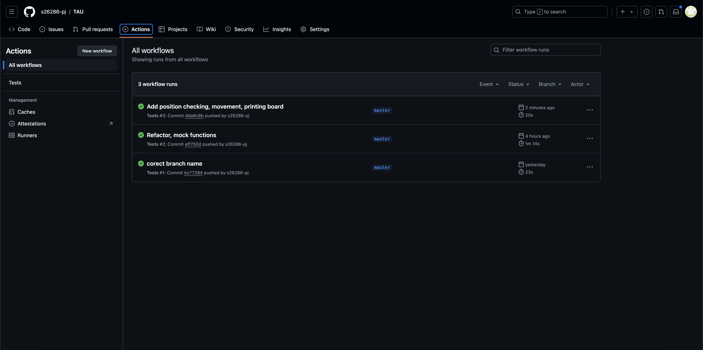
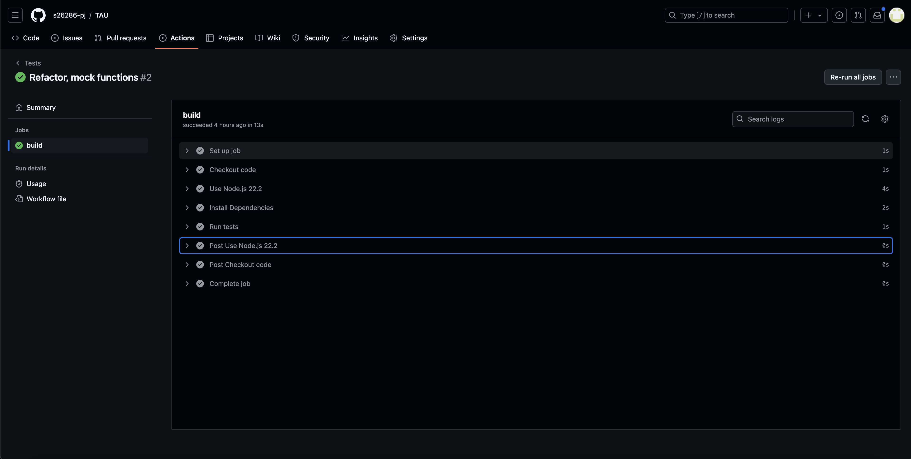

# Laboratorium 3 - zadanie "Prosta Gra"

## Uruchomienie

Wymagane narzędzie nvm bądź node.js w wersji 22.2 (nie testowane na innych)

1. ```nvm use``` - wybór wersji node.js użytej w projekcie (pominąć przy zainstalowanym node.js w wersji 22.2)
2. ```npm install``` - instalacja zależności
3. ```npm run test``` - uruchomienie testów
4. ```npm start``` - uruchomienie aplikacji - wygenerowanie planszy

## Github Actions


